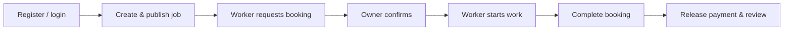
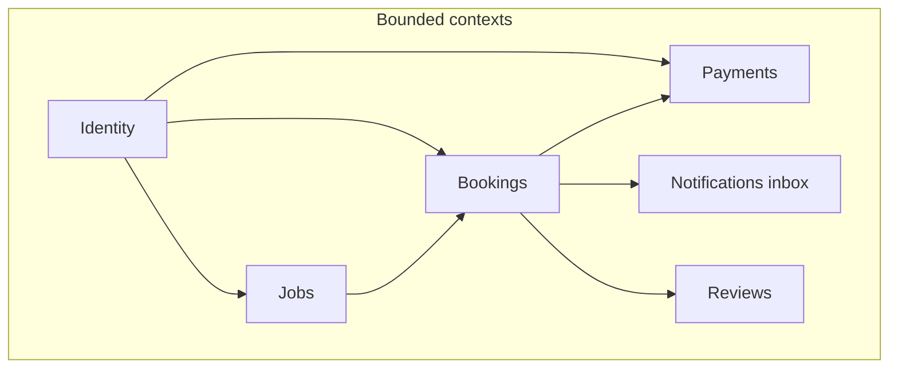

# Product and domain

## Problem and goals

**Problem**: People who need small, local jobs done (e.g. landscaping, moving help, handyman work) need a simple way to connect with people who can do the work. Workers need a straightforward way to find gigs and track completion.

**Goals**:

- Connect job posters with workers for short-term local work.
- **Any registered user can post a job and act as a worker**; there is no separate client-only vs worker-only account type in the product model.
- Support a clear **booking lifecycle** from request through completion (or cancellation).
- Support **demo-style payments** (hold, release, refund) and **in-app notifications** for key transitions.
- Allow **reviews** after a booking is completed.

**Success criteria** (refinable):

- Users can register, post jobs, publish listings, and create bookings against published jobs.
- Job owners can confirm bookings; workers can mark work started; either party can complete or cancel per rules.
- Payment records reflect holds and lifecycle transitions; users see notifications for major events.

---

## User personas

| Persona | Description |
|---------|-------------|
| **User** | Any registered account. Can post jobs, browse published jobs, create bookings as the worker, confirm bookings as the job owner, complete/cancel where allowed, pay (demo), and leave reviews after completion. |
| **Admin** | Not implemented in code; optional future operator for support, disputes, or moderation. |

---

## Core flows

### Happy path

1. **Auth** — User registers (email/password) and signs in; receives JWT for API calls.
2. **Job** — User creates a draft job, optionally adds images (moderated), publishes when ready.
3. **Booking** — Another user requests a booking on a published job; job owner confirms.
4. **Work** — Worker marks booking in progress; later client or worker marks completed.
5. **Payment (demo)** — A hold may exist per booking rules; release/refund follow booking and API actions.
6. **Notifications** — Users see in-app notification rows for domain events (see [06-domain-events-and-notifications.md](06-domain-events-and-notifications.md)).
7. **Review** — After completion, either party may review the other once per booking.

### Key alternatives

- **Cancel booking** — Client or worker can cancel from allowed states; payment side effects run in the same request (see [sequence-booking-payment.md](sequence-booking-payment.md)).
- **Close job** — Owner closes a draft or published job without accepting further bookings.
- **Moderation failure** — Image attach is rejected if Rekognition flags content; object is removed from S3.

---

## Bounded contexts

Logical domains reflected in code and data. They are **not** separate deployables today; they map to folders under `app/api/src/` and separate DynamoDB tables.

| Context | Responsibility |
|---------|----------------|
| **Identity** | Registration, login, refresh, `/auth/me`, lookup user by id (Cognito). |
| **Jobs** | CRUD-style job lifecycle (draft, published, closed), listing, presigned image upload/attach, moderation. |
| **Bookings** | Create/list/get bookings, confirm, start in progress, complete, cancel; booking images. |
| **Payments** | Payment records: hold (API or automatic on confirm), release, refund; demo amounts. |
| **Notifications** | Persisted per-user rows derived from domain event envelopes (`GET /notifications`). |
| **Reviews** | Create review for completed booking; list by reviewee. |
