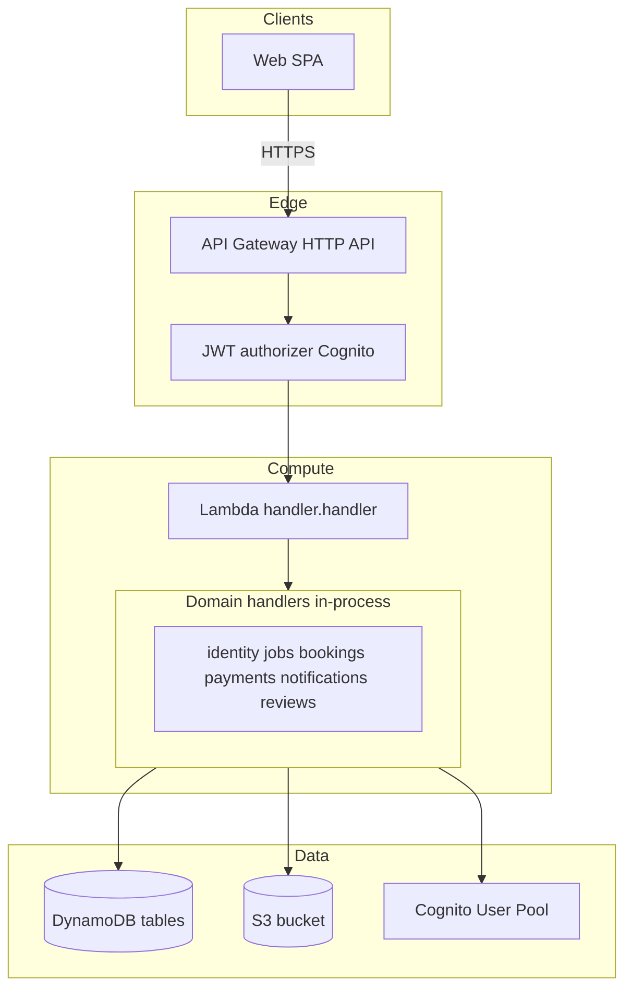
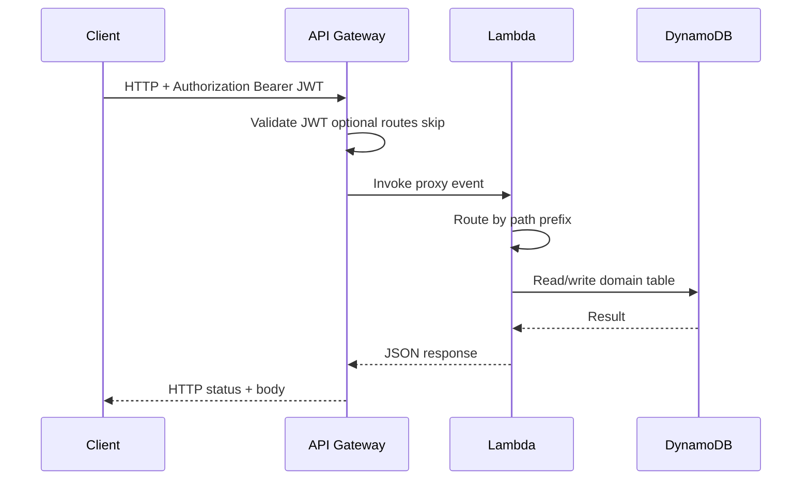
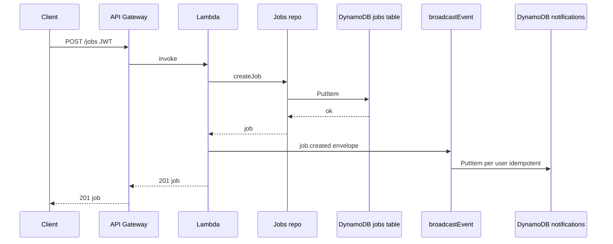

# Architecture overview

For an **AWS service diagram** with official-style icons (draw.io source + optional SVG export for the repo README), see [AWS Architecture.drawio](AWS%20Architecture.drawio) and [10-terraform-environments-and-ci.md](10-terraform-environments-and-ci.md).

## High-level design

Clients use the **Vite/React** SPA (or any HTTP client). All traffic goes through **API Gateway (HTTP API)** with a **JWT authorizer** (Cognito). A single **Lambda** function handles every route and calls domain code under `app/api/src/`. **DynamoDB** stores domain data in separate tables; **S3** stores images; **Rekognition** moderates uploads. There is **no EventBridge/SNS** bus: after state changes, the app builds **event envelopes** and writes **notification rows** in process.

### Request path (sequence)

### Create job (sequence)

---

## Decoupling strategy (current)

| Style | Use in this repo |
|-------|-------------------|
| **Synchronous HTTP** | All client and integration behavior; single Lambda dispatches internally. |
| **In-process calls** | Bookings reads jobs repo; payments reads bookings repo; reviews reads bookings repo; payment hooks after booking transitions. |
| **Async message bus** | Not used. Notification delivery is **synchronous writes** to the notifications table from the same Lambda invocation. |

Future splits (e.g. multiple Lambdas or services) can reintroduce a bus or direct HTTP between units without changing the product contracts documented in [05-api-contracts.md](05-api-contracts.md).

---

## AWS services (as implemented)

| Area | Services |
|------|----------|
| **Compute** | Lambda (Node.js 20), one function for API + one for image moderation |
| **API** | API Gateway HTTP API v2 |
| **Auth** | Cognito User Pool + app client; JWT authorizer on protected routes; email verification flow |
| **Data** | DynamoDB (on-demand) per table: jobs, bookings, payments, notifications, reviews |
| **Objects** | S3 private bucket; presigned URLs from Lambda |
| **ML / safety** | Rekognition image moderation; Comprehend text toxicity detection; Bedrock (Claude Haiku) writing assistant |
| **Payments** | Stripe Payment Intents (`capture_method: manual`); `STRIPE_SECRET_KEY` + `STRIPE_WEBHOOK_SECRET` in SSM SecureString |
| **Config** | SSM Parameter Store (all runtime config loaded per invocation with `WithDecryption: true`) |
| **CI/CD** | CodePipeline + CodeBuild (scoped IAM, not AdministratorAccess) |
| **Grouping** | Resource Groups (tag `StackId` from Terraform provider `default_tags`) |
| **IaC** | Terraform (`infra/*.tf`) |

---

## Deployment

- **Build**: `yarn workspace gig-api build:lambda` produces `app/api/build/package`.
- **Apply**: `yarn deploy` (or `terraform apply` under `infra/`) uploads the zip and updates AWS resources.
- **Frontend env**: `scripts/update-frontend-env.sh` sets `VITE_API_URL` and `VITE_STRIPE_PUBLISHABLE_KEY` from Terraform outputs after every apply.

See root [README.md](../README.md) for commands.
