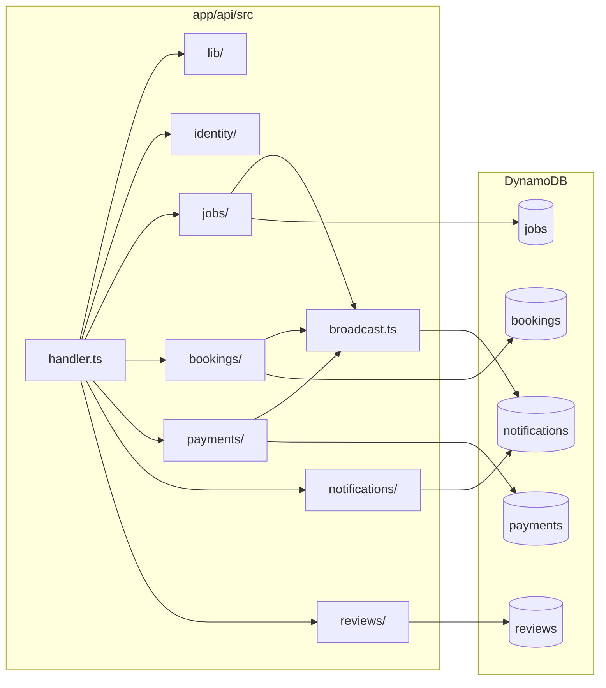

# Bounded contexts and code map

Single deployable (**one Lambda**), multiple **logical** contexts. Code is grouped by domain under `app/api/src/`; Terraform uses **one table per domain** in DynamoDB.

## Context → code → storage

| Context | Folder | Key files | DynamoDB table env var |
|---------|--------|-----------|-------------------------|
| Router | — | `handler.ts` | — |
| Shared utils | `lib/` | `api-helpers.ts`, `logger.ts`, `events-envelope.ts`, `index.ts` | — |
| Identity | `identity/` | `http.ts`, `cognito.ts` | — (Cognito API) |
| Jobs | `jobs/` | `http.ts`, `repository.ts`, `events.ts`, `types.ts` | `JOBS_TABLE_NAME` |
| Bookings | `bookings/` | `http.ts`, `repository.ts`, `events.ts`, `types.ts`; calls `payments/booking-hooks.ts` | `BOOKINGS_TABLE_NAME` |
| Payments | `payments/` | `http.ts`, `repository.ts`, `events.ts`, `booking-hooks.ts`, `stripe-client.ts`, `types.ts` | `PAYMENTS_TABLE_NAME` |
| Notifications | `notifications/` | `http.ts` (list); rows written via `broadcast.ts` | `NOTIFICATIONS_TABLE_NAME` |
| Reviews | `reviews/` | `http.ts`, `repository.ts`, `types.ts` | `REVIEWS_TABLE_NAME` |
| Shared images | `shared/` | `images.ts` (S3 + Rekognition) | `BUCKET_NAME` |

## Shared API utilities (Lambda)

| Path | Role |
|------|------|
| `app/api/src/lib/` | `json()`, `parseBody`, JWT claims helpers, `createEventEnvelope`, `EventEnvelope` type, `devLog` |

## Cross-context rules (in code today)

- Bookings **must not** import payment HTTP handlers; use **`booking-hooks.ts`** after persistence.
- **Identifiers** in app data: **UUIDs** for public ids (`jobId`, `bookingId`, `paymentId`, etc.).
- **Notification idempotency**: `PutItem` with condition on `(userId, eventId)` in `broadcast.ts`.
