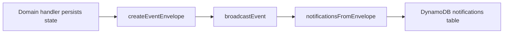

# Domain events and notifications

This stack does **not** publish to EventBridge or SNS. After domain mutations, code builds an **event envelope** (`app/api/src/lib/events-envelope.ts`) and calls **`broadcastEvent`** (`app/api/src/broadcast.ts`), which writes **one DynamoDB item per recipient user** in the notifications table. The same invocation also triggers **payment hooks** from booking handlers where applicable (see [sequence-booking-payment.md](sequence-booking-payment.md)).

---

## Event envelope shape

Defined in `app/api/src/lib/events-envelope.ts`:

| Field | Purpose |
|-------|---------|
| `eventId` | UUID; used for idempotent notification writes (`userId` + `eventId` unique). |
| `eventType` | Dot-separated name, e.g. `job.created`, `booking.confirmed`. |
| `eventVersion` | String, e.g. `1.0`. |
| `correlationId` | From `X-Correlation-Id` header or request id. |
| `timestamp` | ISO time. |
| `producer` | Fixed string `gig-demo` in current code. |
| `payload` | JSON object; fields vary by type (`jobId`, `bookingId`, `clientId`, `workerId`, …). |

---

## Event types (produced in code)

| eventType | Typical producer | Payload highlights |
|-----------|------------------|-------------------|
| `job.created` | Jobs | `jobId`, `clientId`, … |
| `job.published` | Jobs | `jobId`, `clientId` |
| `job.closed` | Jobs | `jobId`, `clientId`, optional `reason` |
| `booking.created` | Bookings | `bookingId`, `jobId`, `workerId`, `clientId`, `status` |
| `booking.confirmed` | Bookings | `bookingId`, `jobId`, `workerId`, `clientId` |
| `booking.in_progress` | Bookings | booking parties, `startedAt` |
| `booking.completed` | Bookings | booking parties, `completedAt` |
| `booking.cancelled` | Bookings | `bookingId`, `jobId`, optional `reason`, parties |
| `payment.hold.created` | Payments / hooks | `paymentId`, `bookingId`, amounts, parties |
| `payment.completed` | Payments | `paymentId`, `bookingId`, … |
| `payment.refunded` | Payments | `paymentId`, `bookingId`, optional `reason` |

---

## Notification fan-out

- **Idempotency**: `PutItem` with `attribute_not_exists(userId) AND attribute_not_exists(eventId)`; duplicate deliveries of the same envelope are safe.
- **Recipients**: Derived in code from `eventType` and `payload` (e.g. `booking.confirmed` notifies `workerId`).

---

## What is *not* here

- No cross-account or cross-region event replay.
- No separate worker Lambda consuming a queue.
- Email/SMS/push are not implemented; only **in-app list** via `GET /notifications`.
