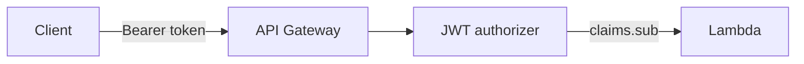

# Security and compliance

## Authentication and authorization

- **Cognito User Pools** for sign-up, password policy, and JWT issuance.
- **API Gateway JWT authorizer** validates tokens for protected routes (see `infra/apigateway.tf`).
- **Application-level checks**: e.g. job owner for publish/close/update; booking parties for booking actions; payment parties for payment reads and some transitions.

---

## Network and exposure

- **Only** API Gateway is public; Lambda has no public URL.
- DynamoDB and S3 are accessed via **IAM role** attached to Lambda; tables and bucket are not internet-exposed.

---

## Secrets and configuration

- **No secrets in repository**: Cognito app client has no secret (`generate_secret = false` for public SPA pattern).
- Pool id and client id are passed to Lambda via **environment variables** from Terraform (non-secret identifiers).
- For production hardening, prefer **SSM Parameter Store** or **Secrets Manager** if you add third-party API keys or DB credentials later.

---

## Encryption

- **DynamoDB**: encryption at rest enabled by default (AWS owned keys) unless overridden by account policy.
- **S3**: server-side encryption on new objects by default in modern buckets.
- **TLS**: clients should use HTTPS to API Gateway only.

---

## IAM

- Lambda execution role uses **least privilege** inline policies scoped to specific table ARNs (and index ARNs where needed), the image bucket, Cognito admin/auth APIs on the user pool, Rekognition, and CloudWatch Logs (via AWS managed policy attachment).

---

## Content safety

- **Rekognition** `DetectModerationLabels` on attach path; rejects and deletes object when confidence exceeds threshold (see `shared/images.ts`).
