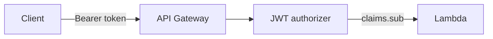

# Security and compliance

## Authentication and authorization

- **Cognito User Pools** for sign-up, password policy, and JWT issuance.
- **API Gateway JWT authorizer** validates tokens for protected routes (see `infra/apigateway.tf`).
- **Application-level checks**: e.g. job owner for publish/close/update; booking parties for booking actions; payment parties for payment reads and some transitions.

---

## Network and exposure

- **Only** API Gateway is public; Lambda has no public URL.
- DynamoDB and S3 are accessed via **IAM role** attached to Lambda; tables and bucket are not internet-exposed.

---

## Secrets and configuration

- **No secrets in repository**: Cognito app client has no secret (`generate_secret = false` for public SPA pattern).
- Pool id and client id are passed to Lambda via SSM Parameter Store (loaded at invocation).
- **Stripe keys** are stored as `SecureString` in SSM (`/{env}/api/STRIPE_SECRET_KEY`, `/{env}/api/STRIPE_WEBHOOK_SECRET`) and loaded by Lambda using `GetParametersByPath` with `WithDecryption: true`. They are never stored in plaintext in DynamoDB or Lambda environment variables.
- Stripe webhook payloads are verified using the `Stripe-Signature` header and `stripe.webhooks.constructEvent` before any processing.

---

## Encryption

- **DynamoDB**: encryption at rest enabled by default (AWS owned keys) unless overridden by account policy.
- **S3**: server-side encryption on new objects by default in modern buckets.
- **TLS**: clients should use HTTPS to API Gateway only.

---

## IAM

- **API Lambda** execution role uses least-privilege inline policies scoped to specific table ARNs, the image bucket, Cognito APIs on the user pool, Rekognition, Comprehend, Bedrock (pinned to specific model ARN), SSM parameter path, and CloudWatch Logs.
- **Moderation Lambda** has a separate, minimal execution role: S3 (images bucket only), Rekognition, DynamoDB UpdateItem on jobs + bookings tables, SSM read, CloudWatch Logs. No Cognito, Comprehend, or Bedrock access.
- **CodeBuild** role uses a scoped inline policy restricted to project-prefixed resources — not `AdministratorAccess`.

---

## Content safety

- **Rekognition** `DetectModerationLabels` on attach path; rejects and deletes object when confidence exceeds threshold (see `shared/images.ts`).
