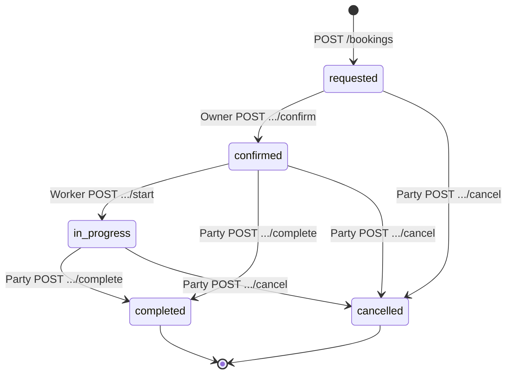
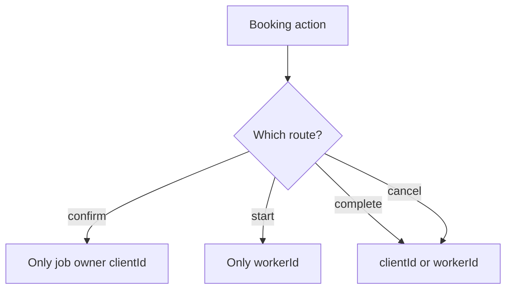
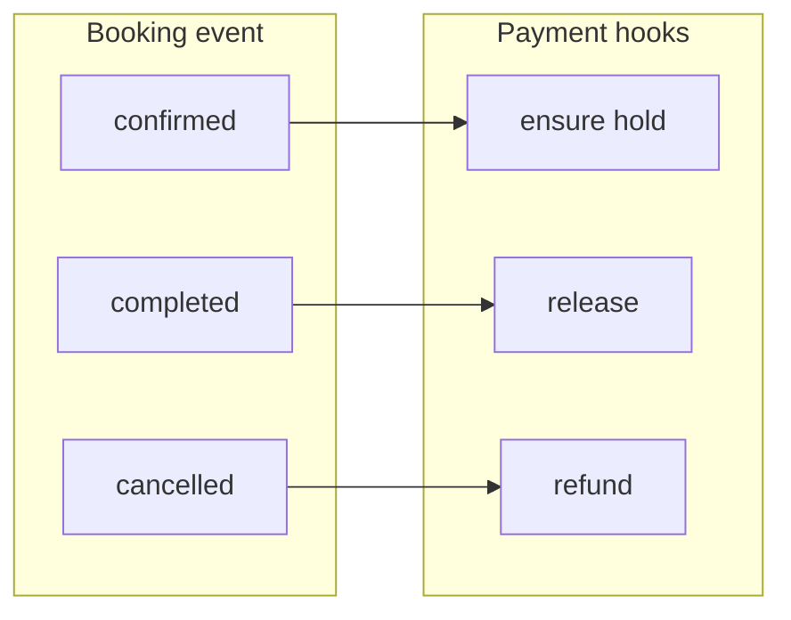

# Flow — booking lifecycle

## State diagram

---

## Decision: who may act

---

## Payment side effects (summary)

Exact rules live in `app/api/src/payments/booking-hooks.ts` and `payments/http.ts`.
