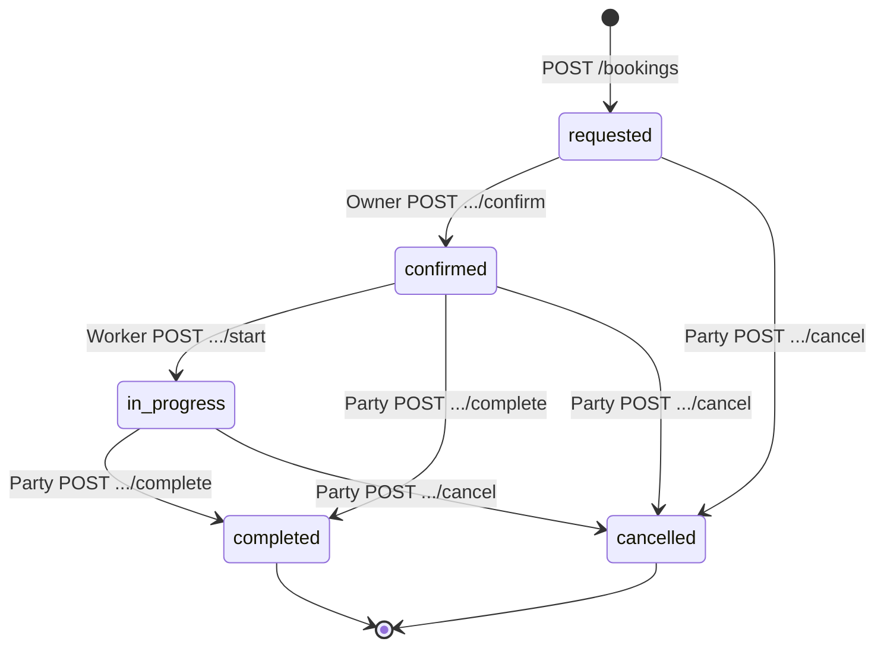
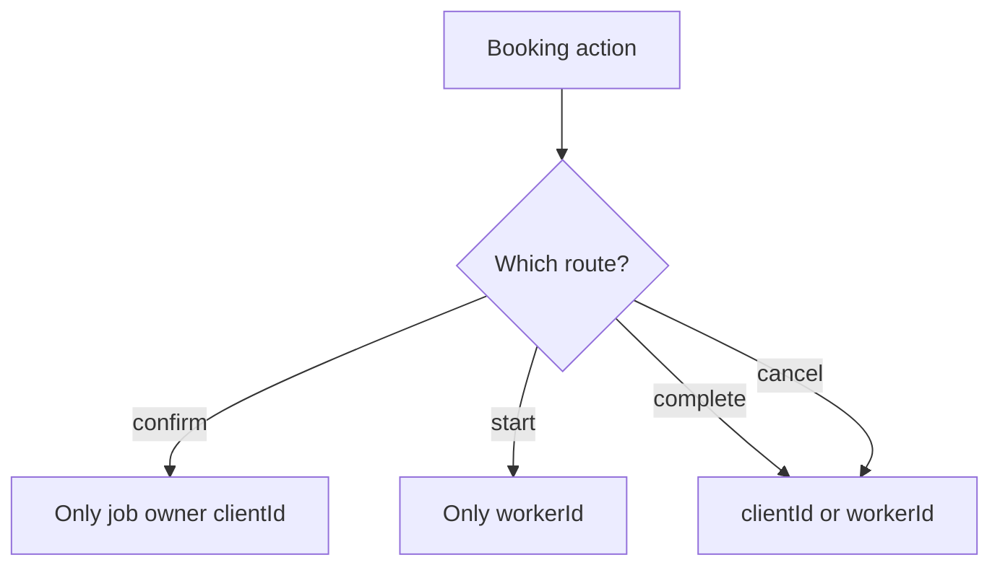
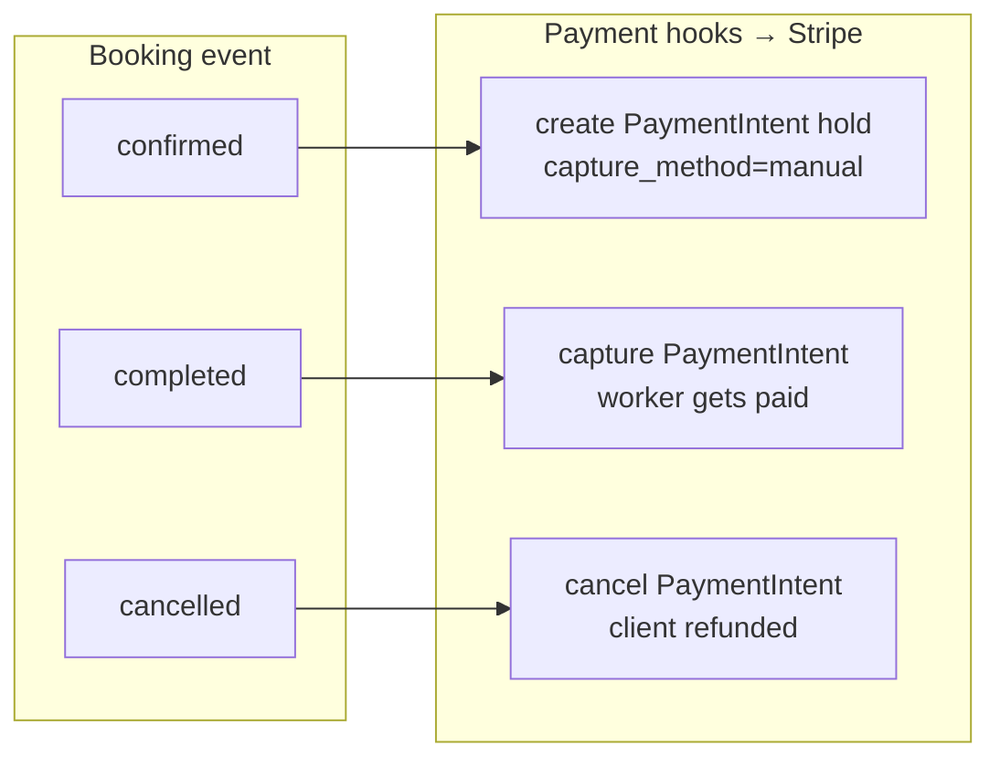

# Flow — booking lifecycle

## State diagram

---

## Decision: who may act

---

## Payment side effects (summary)

- **confirmed**: Stripe PaymentIntent created (`capture_method: manual`). Card held, not charged. Requires `paymentMethodId` from Stripe Elements in the confirm flow.
- **completed**: PaymentIntent captured — funds move to Stripe balance.
- **cancelled**: PaymentIntent cancelled — hold released, client not charged.

When Stripe is not configured or `paymentMethodId` is absent, a $0 placeholder payment record is created with no Stripe side effects (local dev path).

Exact rules live in `app/api/src/payments/booking-hooks.ts` and `payments/http.ts`.
