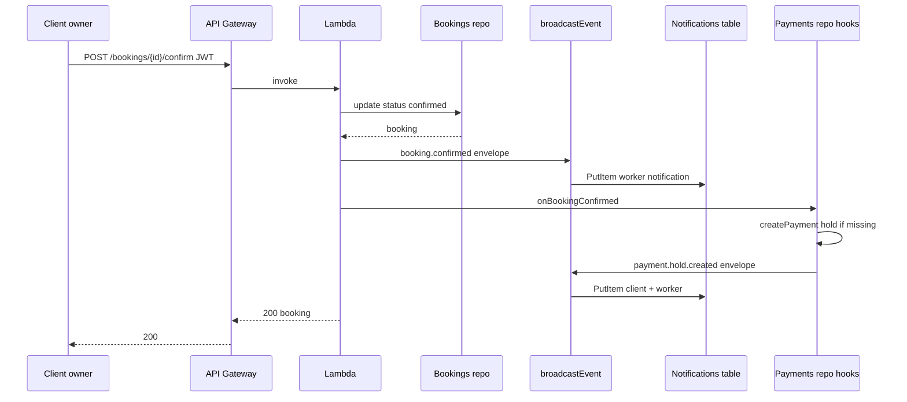
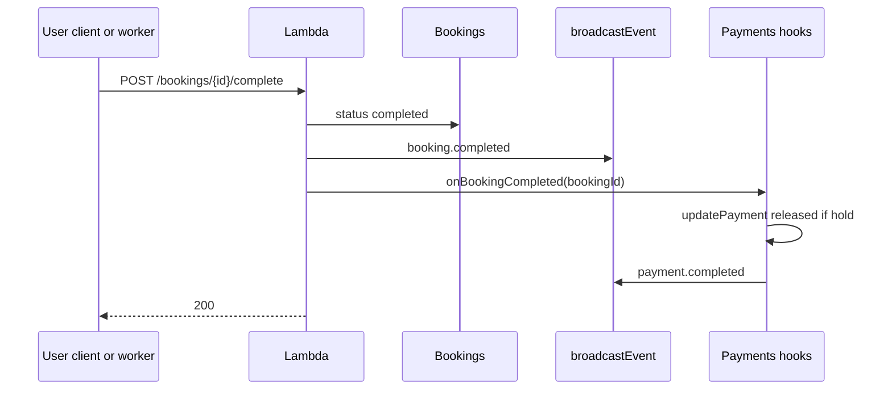
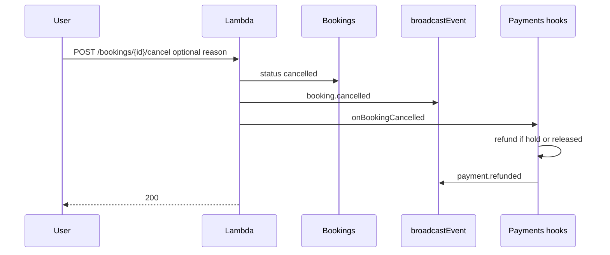

# Sequence — booking lifecycle and payments

End-to-end view of **booking state changes**, **notification fan-out**, and **payment hooks** in the **same Lambda invocation** (no message bus).

---

## Confirm booking (creates demo hold)

---

## Complete booking (release hold)

---

## Cancel booking (refund path)

---

## Manual hold API (optional)

`POST /payments/hold` with idempotency can create a hold when booking is `confirmed` or `in_progress`; automatic hold on confirm may already exist—repository checks prevent duplicate active holds per booking where enforced in code.
