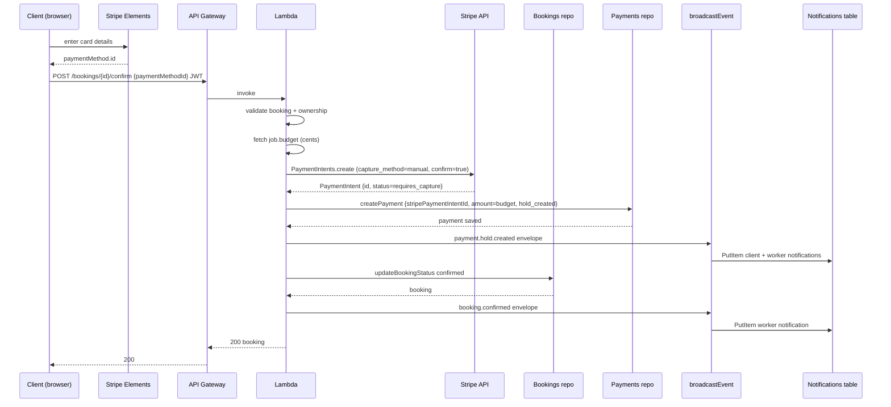
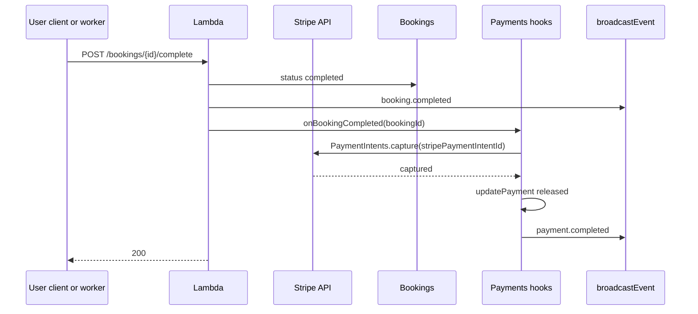
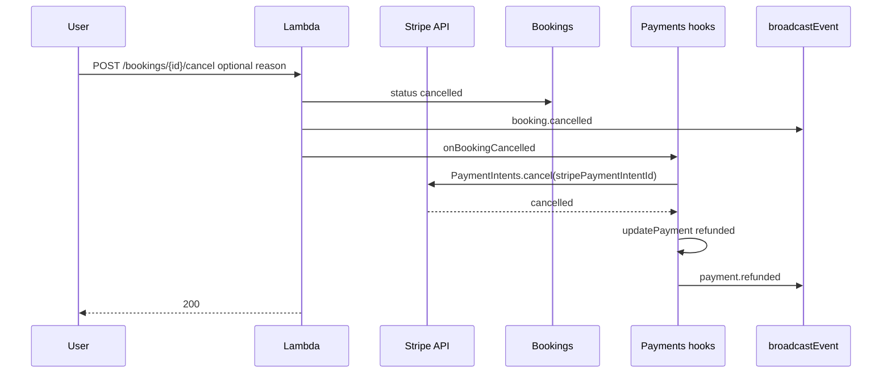

# Sequence — booking lifecycle and payments

End-to-end view of **booking state changes**, **notification fan-out**, and **payment hooks** in the **same Lambda invocation** (no message bus).

---

## Confirm booking (creates Stripe hold)

The payment hold is created **before** the booking status is updated so that a Stripe failure keeps the booking in `requested` and leaves nothing to roll back.

If the PaymentIntent status is not `requires_capture` (e.g. card requires 3D Secure), Lambda returns `402 PAYMENT_REQUIRES_ACTION` and the booking stays `requested`.

---

## Complete booking (captures Stripe hold)

---

## Cancel booking (cancels Stripe hold)

---

## Stripe webhook (async confirmation path)

Stripe delivers events to `POST /payments/webhook` (public route, no JWT). The signature is verified using `STRIPE_WEBHOOK_SECRET` before any processing.

| Event | Action |
|-------|--------|
| `payment_intent.canceled` | If the PaymentIntent was canceled externally, marks the corresponding payment `refunded` in DynamoDB. |

---

## Manual hold API (optional)

`POST /payments/hold` with idempotency can create a hold when booking is `confirmed` or `in_progress`. If `paymentMethodId` is provided, a Stripe PaymentIntent is created the same way as the confirm hook. Repository checks prevent duplicate active holds per booking.
